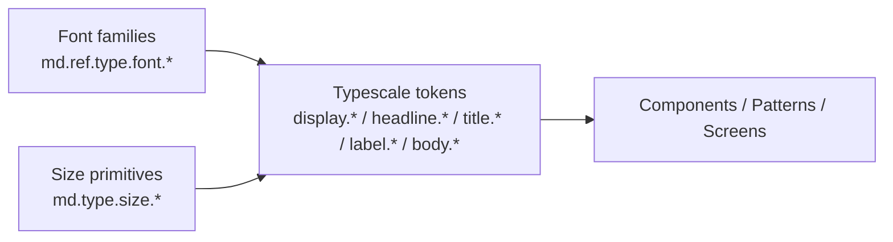

# Foundation: Typography

> Role: Defines all semantic typography tokens. No raw font sizes, weights, or line heights in the reasoning layer.
> Scope: This document is platform-agnostic — it defines what each type style means and when to use it, and applies to any surface built on this design system. Flutter is the primary implementation target, since McAfee products are built in Flutter.
> Rule: NEVER hardcode font size, weight, line height, or letter spacing in component or pattern definitions. Always reference a typescale token.

## Overview

The Assemble typescale is based on the **Material 3 type scale**, and usage intent follows Material 3 closely — the five categories (display, headline, title, label, body), the large/medium/small steps within each, and the role each category plays are the same. Assemble diverges from stock Material 3 in three ways:

1. **Typeface** — McAfee Sans replaces Roboto as the system font; McAfee Sans Mono is the mono companion.
2. **Heavy weight** — an additional weight above emphasized, reserved for display and headline only (see [Font Weights](#font-weights)).
3. **Mono label variants** — a parallel mono set inside the label category for data values (see [Mono Labels](#mono-labels)).

When reasoning about which style to apply, default to Material 3's guidance for the category, then apply the Assemble-specific rules below.

## Token Architecture

Typography tokens are organized in layers, mirroring [[Color]]. Reasoning and implementation must always consume the **semantic** typescale layer.

1. **Font families** (`md.ref.type.font.*`) — the two source typefaces. Authoring only.
2. **Size primitives** (`md.type.size.*`) — raw numeric sizes in px. Used only to build typescale tokens.
3. **Typescale tokens** (`display.*`, `headline.*`, `title.*`, `label.*`, `body.*`) — the meaning layer. The **only** type styles components, patterns, and screens may reference. Each token is a composite bundling family, weight, size, line height, and tracking.

## Font Families

| Token | Value | Use |
| --- | --- | --- |
| md.ref.type.font.system | McAfee Sans | All display, headline, title, body, and standard label styles |
| md.ref.type.font.mono | McAfee Sans Mono | Mono label styles only — data values (see [Mono Labels](#mono-labels)) |

## Font Weights

| Weight role | Value | Where it may be used |
| --- | --- | --- |
| Regular (`normal`) | 400 | Default for every category. The baseline set. |
| Bold (`emphasized`) | 700 | Emphasis within any category — available across the full scale. |
| Heavy | Above bold | **Display and headline only.** Reserved for promotional contexts. |

**Regular** is the default. Reach for it unless there is a reason not to.

**Bold / emphasized** exists for every token in the scale as a parallel `-emphasized` variant. Use it for emphasis within a category — a bolded title, a strong label, a highlighted body run — without changing the size step.

**Heavy is reserved.** It applies only to display and headline styles, and is intended for **promotional areas** — marketing surfaces, upsell and upgrade moments, campaign banners, onboarding and welcome hero moments. It is not a general-purpose emphasis weight:

- ❌ Do not use heavy on title, label, or body styles.
- ❌ Do not use heavy in standard product UI, settings, dashboards, tables, or forms — use emphasized instead.
- ✅ Use heavy for a hero headline on a promotional screen where the type is doing marketing work.

If a promotional layout needs emphasis below the headline level, step down to emphasized rather than pushing heavy onto smaller styles.

---

## Typescale Tokens

Values below are authoritative and come from the token variables. Line height is stored as a multiplier; the computed column is the result at the token's own size, given for reference only — reference the token, never the number.

### Display

Largest styles in the scale. Reserved for short, high-impact text — hero moments, promotional headlines, key numbers on a summary surface. Rarely more than a few words. Sparse by nature; a screen should not carry more than one display element.

| Token | Family | Size | Line height | Computed | Tracking |
| --- | --- | --- | --- | --- | --- |
| display.large | system | 57 | 1.2 | ~68 | -0.25 |
| display.medium | system | 44 | 1.2 | ~53 | 0 |
| display.small | system | 36 | 1.2 | ~43 | 0 |

Emphasized variants (`display.large-emphasized`, `display.medium-emphasized`, `display.small-emphasized`) match their baseline size, line height, and tracking at weight 700. Heavy is permitted on this category for promotional use.

### Headline

High-emphasis text below display. Use for section and screen titles, and for shorter, high-emphasis passages that introduce a region of content. Headline is the other category where heavy is permitted for promotional work.

| Token | Family | Size | Line height | Computed | Tracking |
| --- | --- | --- | --- | --- | --- |
| headline.large | system | 32 | 1.25 | 40 | 0 |
| headline.medium | system | 28 | 1.3 | ~36 | 0 |
| headline.small | system | 24 | 1.3 | ~31 | 0 |

Emphasized variants exist for all three at weight 700. Heavy is permitted on this category for promotional use.

### Title

Medium-emphasis text, smaller than headline. Use for card titles, list and row headers, dialog and sheet titles, and grouping labels inside a surface. This is the workhorse for naming a piece of UI without shouting.

| Token | Family | Size | Line height | Computed | Tracking |
| --- | --- | --- | --- | --- | --- |
| title.large | system | 22 | 1.25 | ~28 | 0 |
| title.medium | system | 18 | 1.5 | 27 | 0.25 |
| title.small | system | 16 | 1.4 | ~22 | 0 |

Emphasized variants exist for all three at weight 700. Heavy is **not** permitted on title.

### Label

Small, utilitarian text for interactive and annotating elements. Use for button labels, chips, tabs, badges, form field labels, helper and caption text. Label is for text that names or annotates a control — not for reading passages; use body for that.

| Token | Family | Size | Line height | Computed | Tracking |
| --- | --- | --- | --- | --- | --- |
| label.large | system | 14 | 1.4 | ~20 | 0 |
| label.medium | system | 12 | 1.3 | ~16 | 0.5 |
| label.small | system | 11 | 1.4 | ~15 | 0.5 |

Emphasized variants exist for all three at weight 700. Heavy is **not** permitted on label.

#### Mono Labels

A parallel mono set inside the label category, set in McAfee Sans Mono. Note the line height is `1.0` — mono labels are intended to sit tight in compact, aligned contexts.

| Token | Family | Size | Line height | Computed | Tracking |
| --- | --- | --- | --- | --- | --- |
| label.mono.large-mono | mono | 14 | 1.0 | 14 | 0 |
| label.mono.medium-mono | mono | 12 | 1.0 | 12 | 0.5 |
| label.mono.small-mono | mono | 11 | 1.0 | 11 | 0.5 |

**Mono is for data values, and is to be used sparingly.** Its purpose is to mark text as a machine value rather than prose — the fixed advance width makes values line up and read as data. Appropriate uses:

- ✅ Data values called out in the UI — a count, a score, a measured quantity
- ✅ Data status text, where the value is the content
- ✅ Outlining or calling out a discrete value so it reads as distinct from surrounding prose
- ✅ Identifiers, versions, codes, and other machine-generated strings

Do not let mono spread beyond that:

- ❌ Not for button labels, tabs, chips, or form field labels — use the standard label styles
- ❌ Not for prose, descriptions, or any reading passage — use body
- ❌ Not for titles or headings of any kind
- ❌ Not as a stylistic accent because it looks technical

Treat mono as a signal with a cost: the more places it appears, the less it communicates. If a surface has mono in more than a couple of spots, most of them are probably wrong.

Emphasized mono variants (`label.mono.large-mono-emphasized`, and medium/small equivalents) exist at weight 700 for the same data-value purpose where emphasis is genuinely needed.

### Body

Text for reading. Use for paragraphs, descriptions, explanatory and supporting copy, and any run of text longer than a few words. Body carries the most generous line heights in the scale because it is the only category meant to be read at length.

| Token | Family | Size | Line height | Computed | Tracking |
| --- | --- | --- | --- | --- | --- |
| body.large | system | 16 | 1.5 | 24 | 0.5 |
| body.medium | system | 14 | 1.4 | ~20 | 0.25 |
| body.small | system | 12 | 1.3 | ~16 | 0.5 |

Emphasized variants exist for all three at weight 700, for emphasis within a passage. Heavy is **not** permitted on body.

---

## Size Primitives

The raw sizes the typescale is built from. **Do not consume these directly in UI** — they are the reference layer.

| Token | Value | Consumed by |
| --- | --- | --- |
| md.type.size.57 | 57 | display.large |
| md.type.size.44 | 44 | display.medium |
| md.type.size.36 | 36 | display.small |
| md.type.size.32 | 32 | headline.large |
| md.type.size.28 | 28 | headline.medium |
| md.type.size.24 | 24 | headline.small |
| md.type.size.22 | 22 | title.large |
| md.type.size.18 | 18 | title.medium |
| md.type.size.16 | 16 | title.small, body.large |
| md.type.size.14 | 14 | label.large, label.mono.large-mono, body.medium |
| md.type.size.12 | 12 | label.medium, label.mono.medium-mono, body.small |
| md.type.size.11 | 11 | label.small, label.mono.small-mono |

---
## Choosing a Style

Resolve in this order:

1. **What is the text doing?** Reading passage → body. Naming a control → label. Naming a surface or region → title. Introducing a section → headline. Hero or key figure → display. Machine value → mono label.
2. **How much hierarchy does the context need?** Pick large/medium/small by the density and importance of the surface, not by how the text looks at a given zoom.
3. **Does it need emphasis?** Use the `-emphasized` variant at the same size step. Do not substitute a larger size for emphasis, and do not reach for heavy.
4. **Is this a promotional surface with a display or headline?** Only then is heavy on the table.

Keep the number of distinct styles on a single surface low. Hierarchy comes from a small set of steps used consistently, not from many nearby sizes.

---
## Rules

1. NEVER hardcode font size, weight, line height, or letter spacing in any component, pattern, or template.
2. NEVER reference `md.ref.type.font.*` or `md.type.size.*` from UI — those are authoring layers.
3. ALWAYS reference a composite typescale token by name (`display.*`, `headline.*`, `title.*`, `label.*`, `body.*`).
4. Heavy weight is permitted on **display and headline only**, and only for promotional contexts. Use emphasized for emphasis everywhere else.
5. Mono label styles are for **data values only**, and are to be used sparingly. Never for controls, prose, or headings.
6. Use the `-emphasized` variant for emphasis rather than changing size step or applying a weight manually.
7. Do not alter a token's line height or tracking at the usage site — if a context needs different metrics, it needs a different token.
8. Pair type with semantic color tokens from [[Color]] — never a raw hex value.
