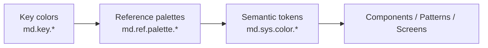

# Foundation: Color

> Role: Defines all semantic color tokens. No hex values in the reasoning layer.
> Rule: NEVER use raw hex/rgb/hsl in component or pattern definitions. Always reference tokens.

## Token Architecture

Assemble color tokens are organized in three layers. Reasoning and implementation must always consume the **semantic** layer — never the reference or key layers.



1. **Key colors** (`md.key.*`) — the small set of source colors that generate every tonal palette. Authoring only.
2. **Reference palettes** (`md.ref.palette.*`, `md.ref.brand.*`) — full tonal scales derived from the key colors. Used only to build semantic tokens.
3. **Semantic tokens** (`md.sys.color.*`, `mcafee.color.extended.*`) — the meaning layer. The **only** colors components, patterns, and screens may reference.

## Token Resolution

Tokens resolve to platform-specific values at build time:

- **Web:** CSS custom properties (`var(--md-sys-color-primary)`)
- **Flutter:** Material roles → `Theme.of(context).colorScheme.*`; extended brand/status roles → `context.asmExtendedColors.*` (see [Flutter Usage](#flutter-usage))

## Semantic Color Token Rules

**Role**

- This layer defines all semantic color tokens.
- Semantic tokens are the only colors that components, patterns, and screens should reference.

**Rules**

1. **Never use raw color values.**
   - Do not use hexadecimal (`#FFFFFF`), RGB, RGBA, HSL, HSLA, or any other hardcoded color values in component or pattern definitions.
   - Always reference a design token.
2. **Never use reference/base color tokens in UI implementations.**
   - Reference (`ref`) or key color tokens are for building semantic tokens only.
   - Components, patterns, and application UI must **never** directly reference `md.ref.*` or `md.key.*`.
3. **Always use semantic color tokens for UI.**
   - Every visual element must reference a semantic token from the system layer (for example, `md.sys.color.*` or `mcafee.color.extended.*`).

**Examples**

✅ Correct

- App canvas → `md.sys.color.background`
- Primary button container → `md.sys.color.primary`
- Primary button text → `md.sys.color.on-primary`
- Success banner → `mcafee.color.extended.positive`

❌ Incorrect

- App canvas → `md.ref.palette.neutral95`
- Primary button → `md.ref.palette.primary50`
- Card background → `#FFFFFF`
- Text color → `rgb(34, 34, 34)`

**Principle**
Reference color tokens define the palette. Semantic color tokens define meaning. UI must always consume semantic tokens—not the underlying palette.

---

## Key Colors

The source colors used to generate the tonal palettes. Authoring only — never referenced by UI.

| Token                     | Value     | Generates palette |
| ------------------------- | --------- | ----------------- |
| md.key.primary            | `#786C6C` | primary           |
| md.key.secondary          | `#6161FF` | secondary         |
| md.key.tertiary           | `#754ADA` | tertiary          |
| md.key.error              | `#FF1C1C` | error             |
| md.key.positive           | `#00A587` | positive          |
| md.key.attention          | `#FF6136` | attention         |
| md.key.neutral            | `#786C6C` | neutral           |
| md.key.neutral-variant    | `#6E6968` | neutral-variant   |

---

## Reference Color Tokens

Each key color expands into a tonal scale. Tones run from `0` (darkest) to `100` (lightest), mixing toward black at the low end and white at the high end. Reference tokens are the palette — **do not consume them directly in UI**.

**Available tones:** `0`, `5`, `10`, `15`, `20`, `25`, `30`, `35`, `40`, `50`, `60`, `70`, `80`, `90`, `95`, `98`, `99`, `100`
(the `neutral` and `neutral-variant` palettes additionally include tone `85`)

**Palettes**

| Palette prefix                     | Source key color        |
| ---------------------------------- | ----------------------- |
| md.ref.palette.primary{tone}       | md.key.primary          |
| md.ref.palette.secondary{tone}     | md.key.secondary        |
| md.ref.palette.tertiary{tone}      | md.key.tertiary         |
| md.ref.palette.error{tone}         | md.key.error            |
| md.ref.palette.positive{tone}      | md.key.positive         |
| md.ref.palette.attention{tone}     | md.key.attention        |
| md.ref.palette.neutral{tone}       | md.key.neutral          |
| md.ref.palette.neutralvariant{tone}| md.key.neutral-variant  |

Example for the primary palette (same tone set applies to every palette above):

| Token                        |
| ---------------------------- |
| md.ref.palette.primary0      |
| md.ref.palette.primary5      |
| md.ref.palette.primary10     |
| md.ref.palette.primary15     |
| md.ref.palette.primary20     |
| md.ref.palette.primary25     |
| md.ref.palette.primary30     |
| md.ref.palette.primary35     |
| md.ref.palette.primary40     |
| md.ref.palette.primary50     |
| md.ref.palette.primary60     |
| md.ref.palette.primary70     |
| md.ref.palette.primary80     |
| md.ref.palette.primary90     |
| md.ref.palette.primary95     |
| md.ref.palette.primary98     |
| md.ref.palette.primary99     |
| md.ref.palette.primary100    |

### Brand Reference Colors

Fixed brand hues (not tonal scales). Referenced only to build extended semantic brand tokens.

| Token                        | Value     |
| ---------------------------- | --------- |
| md.ref.brand.dark-orange     | `#4A2117` |
| md.ref.brand.product-orange  | `#E13121` |
| md.ref.brand.safety-orange   | `#FF402A` |
| md.ref.brand.light-orange    | `#FFCCBE` |
| md.ref.brand.mcafee-dark-red | `#631818` |
| md.ref.brand.mcafee-red      | `#FF1C1C` |
| md.ref.brand.mcafee-light-red| `#FFB3BE` |

---

## Semantic Aliases (`md.sys.color.*`)

The Material system color roles. These are the primary tokens for all UI. Values below show the **Assemble light theme** mapping; dark values are covered in [Dark Mode Mapping](#dark-mode-mapping).

### Primary

| Alias Token                        | Light value (ref)               | Usage                                                           |
| ---------------------------------- | ------------------------------- | -------------------------------------------------------------- |
| md.sys.color.primary               | md.ref.palette.primary0         | Primary accent — high-emphasis fills, key actions              |
| md.sys.color.on-primary            | md.ref.palette.primary100       | Foreground content on `primary` surfaces                       |
| md.sys.color.primary-container     | md.ref.palette.primary10        | Lower-emphasis primary fill (chips, tonal buttons)             |
| md.sys.color.on-primary-container  | md.ref.palette.primary70        | Content on `primary-container`                                 |
| md.sys.color.inverse-primary       | md.ref.palette.primary80        | Primary accent shown on inverse surfaces                       |
| md.sys.color.primary-fixed         | md.ref.palette.primary90        | Primary that stays constant across light/dark                  |
| md.sys.color.on-primary-fixed      | md.ref.palette.primary10        | Content on `primary-fixed`                                     |
| md.sys.color.primary-fixed-dim     | md.ref.palette.primary80        | Dimmer variant of `primary-fixed`                              |
| md.sys.color.on-primary-fixed-variant | md.ref.palette.primary30     | Lower-emphasis content on `primary-fixed`                      |

### Secondary

| Alias Token                          | Light value (ref)             | Usage                                            |
| ------------------------------------ | ----------------------------- | ------------------------------------------------ |
| md.sys.color.secondary               | md.ref.palette.secondary50    | Secondary accent for supporting actions          |
| md.sys.color.on-secondary            | md.ref.palette.secondary100   | Content on `secondary` surfaces                  |
| md.sys.color.secondary-container     | md.ref.palette.secondary80    | Lower-emphasis secondary fill                    |
| md.sys.color.on-secondary-container  | md.ref.palette.tertiary35     | Content on `secondary-container`                 |
| md.sys.color.secondary-fixed         | md.ref.palette.secondary90    | Secondary that stays constant across themes      |
| md.sys.color.on-secondary-fixed      | md.ref.palette.secondary10    | Content on `secondary-fixed`                     |
| md.sys.color.secondary-fixed-dim     | md.ref.palette.secondary80    | Dimmer variant of `secondary-fixed`              |
| md.sys.color.on-secondary-fixed-variant | md.ref.palette.secondary30 | Lower-emphasis content on `secondary-fixed`      |

### Tertiary

| Alias Token                         | Light value (ref)            | Usage                                       |
| ----------------------------------- | ---------------------------- | ------------------------------------------- |
| md.sys.color.tertiary               | md.ref.palette.tertiary40    | Tertiary accent for contrast / balance      |
| md.sys.color.on-tertiary            | md.ref.palette.tertiary100   | Content on `tertiary` surfaces              |
| md.sys.color.tertiary-container     | md.ref.palette.tertiary90    | Lower-emphasis tertiary fill                |
| md.sys.color.on-tertiary-container  | md.ref.palette.tertiary40    | Content on `tertiary-container`             |
| md.sys.color.tertiary-fixed         | md.ref.palette.tertiary90    | Tertiary that stays constant across themes  |
| md.sys.color.on-tertiary-fixed      | md.ref.palette.tertiary10    | Content on `tertiary-fixed`                 |
| md.sys.color.tertiary-fixed-dim     | md.ref.palette.tertiary80    | Dimmer variant of `tertiary-fixed`          |
| md.sys.color.on-tertiary-fixed-variant | md.ref.palette.tertiary30 | Lower-emphasis content on `tertiary-fixed`  |

### Error

| Alias Token                       | Light value (ref)         | Usage                                    |
| --------------------------------- | ------------------------- | ---------------------------------------- |
| md.sys.color.error                | md.ref.palette.error50    | Error / destructive states               |
| md.sys.color.on-error             | md.ref.palette.error100   | Content on `error` surfaces              |
| md.sys.color.error-container      | md.ref.palette.error90    | Lower-emphasis error fill (banners)      |
| md.sys.color.on-error-container   | md.ref.palette.error30    | Content on `error-container`             |

### Background & Surface

| Alias Token                              | Light value (ref)               | Usage                                            |
| ---------------------------------------- | ------------------------------- | ------------------------------------------------ |
| md.sys.color.background                  | md.ref.palette.neutral95        | App canvas / page background                     |
| md.sys.color.on-background               | md.ref.palette.neutral50        | Lowest-emphasis content on surfaces              |
| md.sys.color.surface                     | md.ref.palette.neutral99        | Default surface (cards, sheets)                  |
| md.sys.color.on-surface                  | md.ref.palette.neutral10        | Primary content on surfaces                      |
| md.sys.color.surface-variant             | md.ref.palette.neutral98        | Alternate surface fill, or used for inset areas  |
| md.sys.color.on-surface-variant          | md.ref.palette.neutralvariant30 | Lower-emphasis content on surfaces               |
| md.sys.color.surface-dim                 | md.ref.palette.neutral90        | Dimmest surface tone                             |
| md.sys.color.surface-bright              | md.ref.palette.neutral100       | Brightest surface that's also used cards, sheets |
| md.sys.color.surface-tint                | md.ref.palette.primary40        | Tint overlay for elevated surfaces               |
| md.sys.color.surface-container-lowest    | md.ref.palette.neutral100       | Lowest container elevation                       |
| md.sys.color.surface-container-low       | md.ref.palette.neutral98        | Low container elevation                          |
| md.sys.color.surface-container           | md.ref.palette.neutral90        | Default container elevation                      |
| md.sys.color.surface-container-high      | md.ref.palette.neutral85        | High container elevation                         |
| md.sys.color.surface-container-highest   | md.ref.palette.neutral80        | Highest container elevation                      |

#### Common Background & Surface Usage
-  md.sys.color.background  is dominate app-canvas background though there exception where md.sys.color.surface also can be treated as app.canvas following with surface-bright used as a combination with it for cards, containers, sheets.

- md.sys.color.surface is the default token for surfaces, sheets, and containers. md.sys.color.surface-bright is an optional alternative, used when a designer wants a container to stand out slightly more against the app canvas. Both tokens can be used together within the same layout — for example, using surface as the base and surface-bright to emphasize a specific container.

- md.sys.color.surface-container used as mainly for tertiary UI elements, especially for components like button, text field, and other components.

### Outline & Utility

| Alias Token                        | Light value (ref)               | Usage                                    |
| ---------------------------------- | ------------------------------- | ---------------------------------------- |
| md.sys.color.outline               | md.ref.palette.neutral70        | Inputs, forms and emphasizing borders    |
| md.sys.color.outline-variant       | md.ref.palette.neutral85        | Default borders, dividers and            |
| md.sys.color.shadow                | `#8E8E8E30`                     | Drop shadow color                        |
| md.sys.color.scrim                 | md.ref.palette.neutral0         | Modal / sheet scrim overlay              |
| md.sys.color.inverse-surface       | md.ref.palette.neutral20        | Inverted surface (snackbars, tooltips)   |
| md.sys.color.inverse-on-surface    | md.ref.palette.neutral98        | Content on `inverse-surface`             |

---

## Extended Semantic Aliases (`mcafee.color.extended.*`)

Brand-specific roles that branch beyond the Material set — status colors, brand hues, and gradients.

### Status: Positive & Attention

| Token                                         | Light value (ref)             | Usage                                  |
| --------------------------------------------- | ----------------------------- | -------------------------------------- |
| mcafee.color.extended.positive                | md.ref.palette.positive40     | Success / positive state accent        |
| mcafee.color.extended.on-positive             | md.ref.palette.positive100    | Content on `positive`                  |
| mcafee.color.extended.positive-container      | md.ref.palette.positive90     | Positive subtle / fill                 |
| mcafee.color.extended.on-positive-container   | md.ref.palette.positive20     | Content on `positive-container`        |
| mcafee.color.extended.attention               | md.ref.palette.attention50    | Warning / attention accent             |
| mcafee.color.extended.on-attention            | md.ref.palette.attention100   | Content on `attention`                 |
| mcafee.color.extended.attention-container     | md.ref.brand.light-orange     | Attention subtle / fill                |
| mcafee.color.extended.on-attention-container  | md.ref.brand.product-orange   | Content on `attention-container`       |

### Brand

| Token                                    | Light value (ref)             | Usage                                |
| ---------------------------------------- | ----------------------------- | ------------------------------------ |
| mcafee.color.extended.brand              | md.ref.brand.mcafee-red       | Primary brand accent                 |
| mcafee.color.extended.brand-orange       | md.ref.brand.product-orange   | For product UI brand accent               |
| mcafee.color.extended.on-brand           | md.ref.palette.primary100     | Content on `brand`                   |
| mcafee.color.extended.brand-subtle       | md.ref.brand.mcafee-light-red | Low-emphasis brand fill              |
| mcafee.color.extended.on-brand-subtle    | mcafee.color.extended.brand   | Content on `brand-subtle`            |

### Utility

| Token                                 | Light value              | Usage                              |
| ------------------------------------- | ------------------------ | ---------------------------------- |
| mcafee.color.extended.black           | md.ref.palette.primary0  | True black                         |
| mcafee.color.extended.white           | `#FFFFFF`                | True white                         |
| mcafee.color.extended.ghost           | `#00000030`              | Ghost / translucent overlay        |
| mcafee.color.extended.transparent     | `#00000000`              | Fully transparent                  |
| mcafee.color.extended.opaque.dark-40  | `#00000066`              | 40% black scrim                    |
| mcafee.color.extended.opaque.dark-60  | `#00000099`              | 60% black scrim                    |

### Gradients

| Token                                                    | Stops                                                        | Usage                          |
| -------------------------------------------------------- | ----------------------------------------------------------- | ------------------------------ |
| mcafee.color.extended.gradient.surface.high              | safety-orange → secondary                                   | High-emphasis surface gradient |
| mcafee.color.extended.gradient.surface.moderate          | secondary → mcafee-red                                      | Moderate surface gradient      |
| mcafee.color.extended.gradient.surface.low               | positive → secondary                                        | Low-emphasis surface gradient  |
| mcafee.color.extended.gradient.surface.loader            | surface-container-highest → surface                         | Loading / shimmer gradient     |
| mcafee.color.extended.gradient.brand                     | safety-orange → secondary                                   | Brand gradient                 |
| mcafee.color.extended.gradient.opaque                    | background → transparent background                         | Fade-to-canvas overlay         |

---

## State Layers (`md.sys.state.*`)

Interaction states are expressed as alpha overlays of a key color. Reference these instead of hardcoding opacities.

| State    | Alpha | Example token                    |
| -------- | ----- | -------------------------------- |
| hover    | 0.08  | md.sys.state.primary.hover       |
| focus    | 0.10  | md.sys.state.primary.focus       |
| pressed  | 0.10  | md.sys.state.primary.pressed     |
| dragged  | 0.16  | md.sys.state.primary.dragged     |

State layers exist per accent role (`primary`, `secondary`, …), each keyed to a `.key` base color.

---

## Dark Mode Mapping

Dark mode is a separate theme mode — never hardcode dark values. The semantic token names stay identical; only their reference palette targets change. Swap by activating the dark mode set, not by re-referencing tokens.

| Semantic token                    | Light (ref)                     | Dark (ref)                        |
| --------------------------------- | ------------------------------- | --------------------------------- |
| md.sys.color.primary              | md.ref.palette.primary0         | md.ref.palette.primary100         |
| md.sys.color.on-primary           | md.ref.palette.primary100       | md.ref.palette.primary0           |
| md.sys.color.primary-container    | md.ref.palette.primary10        | md.ref.palette.primary10          |
| md.sys.color.on-primary-container | md.ref.palette.primary70        | md.ref.palette.primary60          |
| md.sys.color.secondary            | md.ref.palette.secondary50      | md.ref.palette.secondary80        |
| md.sys.color.on-secondary         | md.ref.palette.secondary100     | md.ref.palette.secondary20        |
| md.sys.color.secondary-container  | md.ref.palette.secondary80      | md.ref.palette.tertiary35         |
| md.sys.color.tertiary             | md.ref.palette.tertiary40       | md.ref.palette.tertiary99         |
| md.sys.color.error                | md.ref.palette.error50          | md.ref.palette.error60            |
| md.sys.color.background           | md.ref.palette.neutral95        | md.ref.palette.neutralvariant5    |
| md.sys.color.on-background        | md.ref.palette.neutral50        | md.ref.palette.neutralvariant60   |
| md.sys.color.surface              | md.ref.palette.neutral99        | md.ref.palette.neutralvariant10   |
| md.sys.color.on-surface           | md.ref.palette.neutral10        | md.ref.palette.neutralvariant90   |
| md.sys.color.surface-variant      | md.ref.palette.neutral98        | md.ref.palette.neutralvariant15   |
| md.sys.color.outline              | md.ref.palette.neutral70        | md.ref.palette.neutral40          |
| md.sys.color.outline-variant      | md.ref.palette.neutral85        | md.ref.palette.neutral20          |
| md.sys.color.inverse-surface      | md.ref.palette.neutral20        | md.ref.palette.neutralvariant90   |
| md.sys.color.inverse-primary      | md.ref.palette.primary80        | md.ref.palette.primary40          |

Additional contrast tiers (`light-medium-contrast`, `light-high-contrast`, and their dark counterparts) exist per brand for accessibility. They follow the same token names with tuned reference targets.

---

## Themes / Brands

The token library ships multiple brand collections. Each provides its own key colors and semantic mode files, but exposes the **same semantic token names**, so components stay brand-agnostic.

| Brand    | Material palette source        | Modes                                                           |
| -------- | ------------------------------ | --------------------------------------------------------------- |
| assemble | tokens/material/assemble.json  | light, dark, contrast                                           |

---

## Flutter Usage

Flutter consumes the tokens through the `assemble_flutter_tokens` package (`package:assemble_flutter_tokens/assemble_tokens.dart`). Semantic Material roles resolve to a standard Flutter `ColorScheme`; extended brand/status roles, state layers, and gradients are exposed through `AsmTokens`.

**Wire up the theme**

- `asmColorScheme(brightness: Brightness.light /* or .dark */)` returns the Material `ColorScheme` — pass it to `ThemeData(colorScheme: ...)`.
- `AsmTokens.of(context)` (or the `context.asmTokens` extension) aggregates `colorScheme`, `extended`, `state`, and `shadows` for the active brightness.

**Semantic Material roles** → `Theme.of(context).colorScheme.*`

| Token                              | Flutter                          |
| ---------------------------------- | -------------------------------- |
| md.sys.color.primary               | colorScheme.primary              |
| md.sys.color.on-primary            | colorScheme.onPrimary            |
| md.sys.color.surface               | colorScheme.surface              |
| md.sys.color.surface-container     | colorScheme.surfaceContainer     |
| md.sys.color.outline               | colorScheme.outline              |

**Extended roles** → `context.asmExtendedColors.*` (`AsmExtendedColors`)

| Token                                   | Flutter                              |
| --------------------------------------- | ------------------------------------ |
| mcafee.color.extended.positive          | asmExtendedColors.positive           |
| mcafee.color.extended.on-positive       | asmExtendedColors.onPositive         |
| mcafee.color.extended.attention         | asmExtendedColors.attention          |
| mcafee.color.extended.brand             | asmExtendedColors.brand              |
| mcafee.color.extended.brand-orange      | asmExtendedColors.brandOrange        |
| mcafee.color.extended.brand-subtle      | asmExtendedColors.brandSubtle        |

State layers resolve through `context.asmStateColors.*` and gradients through `context.asmGradients.*`.

```dart
final scheme = Theme.of(context).colorScheme;
Container(
  color: scheme.surface,
  child: Text(
    'Protected',
    style: TextStyle(color: context.asmExtendedColors.positive),
  ),
);
```

**Dark mode** is driven by `Brightness` — let `asmColorScheme` / `AsmTokens` resolve the values; never hardcode dark hex.

---

## Rules

1. NEVER use hex, rgb, or hsl values directly in any component, pattern, or template.
2. NEVER reference `md.key.*` or `md.ref.*` (palette or brand) from UI — those are authoring layers.
3. ALWAYS reference semantic tokens by name (`md.sys.color.*`, `mcafee.color.extended.*`).
4. When composing dark mode, swap the active theme mode — never hardcode dark values or re-point tokens.
5. Use `md.sys.state.*` overlays for interaction states rather than custom opacities.
6. Minimum contrast ratios: 4.5:1 (normal text), 3:1 (large text), 3:1 (interactive elements). Use the medium/high-contrast modes when stronger ratios are required.