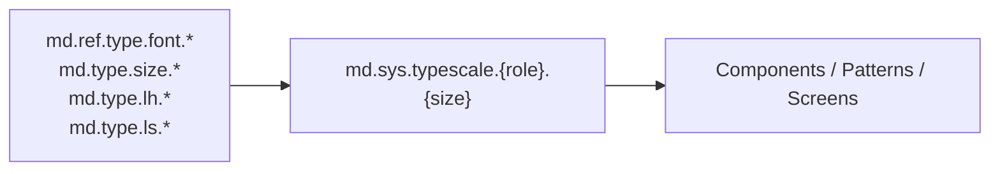

# Foundation: Typography

> Role: Defines the type scale following the Material 3 type system.
> Rule: NEVER use arbitrary font sizes. Select a type **role** and **size** — always reference a `md.sys.typescale.*` token.

## The Material 3 Type Scale

Assemble's typography follows the Material 3 type scale exactly. A type style is not chosen by pixel size — it is chosen by **role** (the purpose of the text) and then by **size** within that role. This is the core M3 rule: pick the role that matches the content's function, not a font size.

There are **five roles**, each available in **three sizes** (`large` / `medium` / `small`), for **15 base styles**. Each base style has a parallel **emphasized** variant (`-bold`), mirroring M3's emphasized type styles — giving 30 named styles in total.

```
Role  →  Size            →  Emphasis
display  large/medium/small  (+ -bold)
headline large/medium/small  (+ -bold)
title    large/medium/small  (+ -bold)
body     large/medium/small  (+ -bold)
label    large/medium/small  (+ -bold)
```

Each style is a **composite token** bundling five properties — exactly as M3 defines a type style:

`fontFamily` · `fontWeight` · `fontSize` · `lineHeight` · `letterSpacing (tracking)`

## Token Composition

Each `md.sys.typescale.*` style is composed from primitives. UI consumes only the composite `md.sys.typescale.*` token — never the primitives directly.



## Token Resolution

- **Web:** each style exposes one CSS custom property per axis —
  `--md-sys-typescale-{role}-{size}-fontFamily`, `-fontSize`, `-fontWeight`, `-lineHeight`, `-letterSpacing`
- **Flutter:** ready-made `TextStyle`s via `context.asmTypographyTokens.{role}{Size}` (e.g. `titleMedium`) — see [Flutter Usage](#flutter-usage)

```css
.card-title {
  font-family: var(--md-sys-typescale-title-medium-fontFamily);
  font-size: var(--md-sys-typescale-title-medium-fontSize);
  font-weight: var(--md-sys-typescale-title-medium-fontWeight);
  line-height: var(--md-sys-typescale-title-medium-lineHeight);
  letter-spacing: var(--md-sys-typescale-title-medium-letterSpacing);
}
```

## The Five Roles

Choose the role by the job the text does — this is the primary M3 rule.

| Role         | Purpose (M3)                                                                                          |
| ------------ | ---------------------------------------------------------------------------------------------------- |
| **Display**  | Largest text. Reserved for short, high-impact strings and numerals — hero moments, marketing, splash. |
| **Headline** | High-emphasis, short text that marks primary passages or key regions of a screen.                     |
| **Title**    | Medium-emphasis, relatively short text — section headers, card titles, dialog titles, app bars.       |
| **Body**     | Long-form reading text — paragraphs, descriptions, and the default running text.                      |
| **Label**    | Utilitarian text inside components — buttons, chips, tabs, captions, and annotations.                 |

Within a role, use `large` by default and step down to `medium` / `small` as space, density, or hierarchy require.

## Type Scale Tokens

All styles use `md.ref.type.font.system` (McAfee Sans). Line height and letter spacing (tracking) are expressed as percentages, per the token source.

### Display

| Token                           | Size | Line Height | Tracking | Weight |
| ------------------------------- | ---- | ----------- | -------- | ------ |
| md.sys.typescale.display.large  | 57px | 120%        | -0.25%   | normal |
| md.sys.typescale.display.medium | 44px | 120%        | 0        | normal |
| md.sys.typescale.display.small  | 36px | 120%        | 0        | normal |

### Headline

| Token                            | Size | Line Height | Tracking | Weight |
| -------------------------------- | ---- | ----------- | -------- | ------ |
| md.sys.typescale.headline.large  | 32px | 125%        | 0        | normal |
| md.sys.typescale.headline.medium | 28px | 130%        | 0        | normal |
| md.sys.typescale.headline.small  | 24px | 130%        | 0        | normal |

### Title

| Token                         | Size | Line Height | Tracking | Weight |
| ----------------------------- | ---- | ----------- | -------- | ------ |
| md.sys.typescale.title.large  | 22px | 125%        | 0        | normal |
| md.sys.typescale.title.medium | 18px | 150%        | +0.25%   | normal |
| md.sys.typescale.title.small  | 16px | 140%        | 0        | normal |

### Body

| Token                        | Size | Line Height | Tracking | Weight |
| ---------------------------- | ---- | ----------- | -------- | ------ |
| md.sys.typescale.body.large  | 16px | 150%        | +0.5%    | normal |
| md.sys.typescale.body.medium | 14px | 140%        | +0.25%   | normal |
| md.sys.typescale.body.small  | 12px | 130%        | +0.5%    | normal |

### Label

| Token                         | Size | Line Height | Tracking | Weight |
| ----------------------------- | ---- | ----------- | -------- | ------ |
| md.sys.typescale.label.large  | 14px | 140%        | 0        | normal |
| md.sys.typescale.label.medium | 12px | 130%        | +0.5%    | normal |
| md.sys.typescale.label.small  | 11px | 140%        | +0.5%    | normal |

## Emphasized Styles

Every base style has an emphasized counterpart that swaps the weight from `normal` (Regular) to `emphasized` (Bold) while keeping size, line height, and tracking identical. Append `-bold` to the size:

- `md.sys.typescale.headline.large-bold`
- `md.sys.typescale.title.medium-bold`
- `md.sys.typescale.body.large-bold`
- `md.sys.typescale.label.large-bold`

Use emphasized styles to add stress within a role without jumping to a different role or size.

## Font Families

| Token                       | Value                        | Usage                                     |
| --------------------------- | ---------------------------- | ----------------------------------------- |
| md.ref.type.font.system     | `McAfee Sans`                | Default — every type scale role           |
| md.ref.type.font.mono       | `McAfee Sans Mono`           | Code and numeric/technical data           |
| md.ref.type.font.expressive | `McAfee Sans Mono Condensed` | Expressive display / marketing accents    |

## Font Weights

The scale uses only two weights — a regular and an emphasized (bold). There is no light/medium/semibold tier in the type scale.

| Token       | Value     | Numeric | Applies to                     |
| ----------- | --------- | ------- | ------------------------------ |
| normal      | `Regular` | 400     | All base styles                |
| emphasized  | `Bold`    | 700     | All `-bold` styles             |

## Primitives (authoring only)

Used only to compose `md.sys.typescale.*` — never referenced directly by UI.

**Font sizes** `md.type.size.{n}` (px): `10`, `11`, `12`, `14`, `16`, `18`, `20`, `22`, `24`, `28`, `32`, `36`, `40`, `44`, `48`, `57`, `64`, `72`, `84`, `96`

**Line heights** `md.type.lh.{n}` (%): `100`, `110`, `120`, `125`, `130`, `140`, `150`, `160`, `170`, `180`, `190`, `200`

**Tracking** `md.type.ls.*`: `negative150` … `negative025`, `zero`, `positive025` … `positive150` (0.25% steps)

## Flutter Usage

Flutter consumes the type scale through the `assemble_flutter_tokens` package as ready-made `TextStyle`s. Access them via `AsmTokens.typography` or the `context.asmTypographyTokens` extension — each getter maps 1:1 to a `md.sys.typescale.*` token.

| Token (web)                        | Flutter getter                        |
| ---------------------------------- | ------------------------------------- |
| md.sys.typescale.display.large     | asmTypographyTokens.displayLarge      |
| md.sys.typescale.headline.medium   | asmTypographyTokens.headlineMedium    |
| md.sys.typescale.title.medium      | asmTypographyTokens.titleMedium       |
| md.sys.typescale.body.large        | asmTypographyTokens.bodyLarge         |
| md.sys.typescale.label.large       | asmTypographyTokens.labelLarge        |

Emphasized (`-bold`) styles append `Emphasized` to the getter:

- `md.sys.typescale.headline.large-bold` → `asmTypographyTokens.headlineLargeEmphasized`
- `md.sys.typescale.body.medium-bold` → `asmTypographyTokens.bodyMediumEmphasized`

```dart
Text('Section title', style: context.asmTypographyTokens.titleMedium);
Text('Total', style: context.asmTypographyTokens.headlineLargeEmphasized);
```

**Font families** are exposed as `AsmFontFamilies.system` / `.mono` / `.expressive`. A set of mono ramps — `labelLargeMono`, `labelMediumMono`, `labelSmallMono` (each with an `Emphasized` variant), plus `bodyMonoSmall` / `bodyMonoMedium` — is available for numeric and metadata text (badges, timestamps, stat values).

> In Flutter, never assemble a `TextStyle` from a raw size/weight — use a typography getter so all five axes stay composed and in sync with the tokens.

## Rules

1. Choose a type style by **role first, then size** — never by picking a raw pixel value.
2. NEVER use arbitrary font sizes — always reference a `md.sys.typescale.*` composite token.
3. NEVER reference primitives (`md.type.size/lh/ls`, `md.ref.type.font`) from UI — they exist only to build the scale.
4. Apply all five properties of a style together (family, weight, size, line height, tracking) — never cherry-pick one axis.
5. For emphasis within a role, use the `-bold` (emphasized) variant — do not invent intermediate weights.
6. `display` is for short, high-impact strings only — never for body copy.
7. `body` roles are for long-form text; `label` roles are for component text (buttons, chips, tabs, captions).
8. `md.ref.type.font.mono` is ONLY for code and numeric/technical data.
9. Limit each screen to a few type styles; keep body line length ~50–75 characters.
10. NEVER hardcode `font-family`, `font-size`, `font-weight`, `line-height`, or `letter-spacing` in components.
